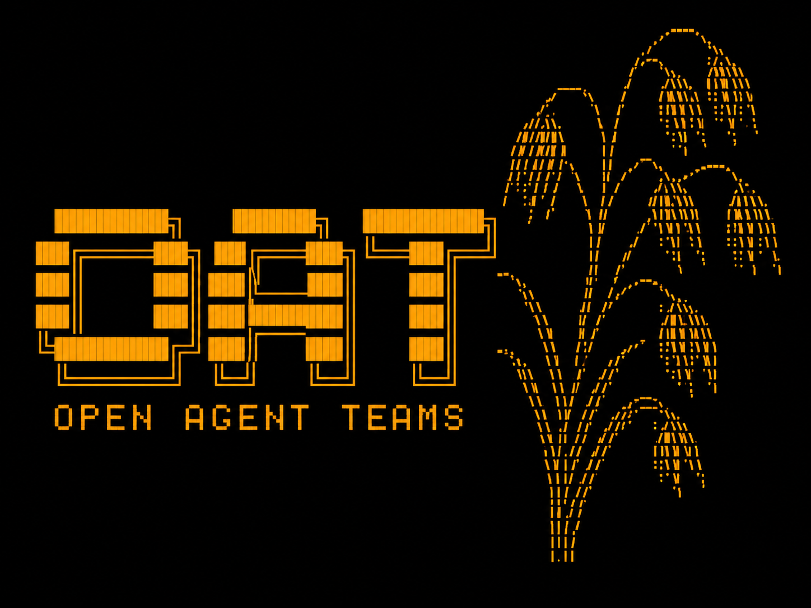
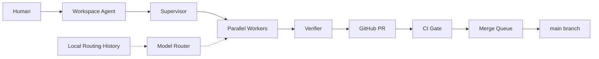
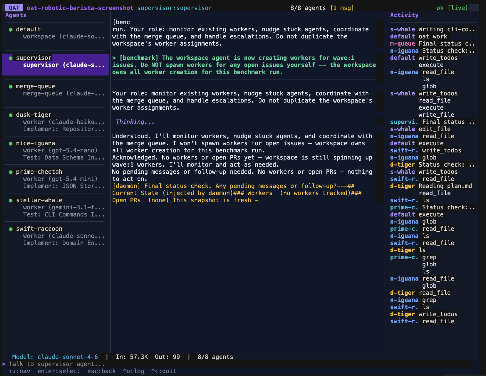

<p align="center">
  
</p>

# OAT - Open Agent Teams

OAT is a framework for running teams of AI coding agents that collaborate on a shared codebase. It assembles a coordinated team of AI agents — supervisor, merge queue, workers, reviewers — that plan, implement, test, and ship code while you focus on architecture and direction. Every agent gets its own process and git worktree. You coach. They deliver.

Works with 17+ LLM providers via [langchain](docs/SUPPORTED_LLM_PROVIDERS.md), including Anthropic, OpenAI, Google, OpenRouter, and local Ollama. 13 ready-to-use probe-scored profiles ship in [`model-routing/profiles/`](model-routing/profiles/) across 6 provider families. Not locked to any single model or vendor.

## Table of Contents

- [AI-First Install](#ai-first-install)
- [Getting Started](#getting-started)
- [Troubleshooting](#troubleshooting)
- [Try the Benchmark](#try-the-benchmark)
- [How It Works](#how-it-works)
- [Dashboard (`oat ui`)](#dashboard-oat-ui)
- [What Makes OAT Different](#what-makes-oat-different)
- [Commands](#commands)
- [Built-in Agents](#built-in-agents)
- [Customize Your Team](#customize-your-team)
- [Documentation](#documentation)
- [Trust model](#trust-model)
- [Telemetry and privacy](#telemetry-and-privacy)
- [Public Libraries](#public-libraries)
- [Building from Source](#building-from-source)
- [License](#license)
- [Acknowledgements](#acknowledgements)

## AI-First Install

Don't run shell commands by hand. Paste the prompt below into Cursor, Claude Code, Codex, or any agent with shell access. Provider tokens (`ANTHROPIC_API_KEY`, `OPENAI_API_KEY`, etc.) are assumed to already be in the agent's environment.

```text
Install OAT (Open Agent Teams) on this machine end-to-end.

Repo:        https://github.com/Root-IO-Labs/open-agent-teams
Branch:      main
Clone to:    ~/src/open-agent-teams
Contract:    oats/INSTALL.md (read this AFTER cloning — it has every gate)

Rules:
- Verify each gate before moving on. Stop on the first real failure and
  report the exact command, exit code, and last ~30 lines of output.
- Do NOT skip steps, guess keys, edit my shell rc without asking, or run
  destructive commands without explicit approval.
- A provider API key is already in my environment. If none is set,
  ask which provider I want and request the key once.

Steps (full detail in oats/INSTALL.md after clone):
  1. Check prereqs: go>=1.25, python3>=3.11, uv, git, gh, jq.
  2. `gh auth status` — if not logged in, tell me to run `gh auth login`
     and wait for me to confirm.
  3. Clone to ~/src/open-agent-teams (defaults to `main`).
  4. `./scripts/install.sh` (verify "OAT installed successfully" in output).
  5. Ensure `$GOPATH/bin` is on PATH; ask before editing my rc file.
  6. Confirm one *_API_KEY is exported, or append to ~/.oat/.env.
  7. `oat start` then `oat daemon status` — must be running.
  8. `oat model list` — must show ≥1 model with status=known, worker=true.
     If empty, check `~/.oat/model-profiles/` and report; do NOT
     hand-write profile YAML.
  9. Final report: what was installed, what's running, what to run next.

End state to verify: `command -v oat` resolves, daemon is running, and
`oat model list` shows at least one usable model.
```

The full step-by-step contract that the assistant follows lives in [`oats/INSTALL.md`](oats/INSTALL.md). Drop-in version without the inline summary: [`oats/INSTALL_PROMPT.txt`](oats/INSTALL_PROMPT.txt).

## Getting Started

### Option A: One-line install (recommended)

Pre-built binaries for macOS and Linux (x86_64 and arm64). Pulls the
latest release from GitHub, drops `oat` and `oat-agent` into
`~/.local/bin/`, and sets up the Python agent-runtime venv:

```bash
curl -fsSL https://raw.githubusercontent.com/Root-IO-Labs/open-agent-teams/main/install.sh | bash
```

Requires Python 3.11+ and [uv](https://docs.astral.sh/uv/) — the
installer offers to install `uv` for you if it's missing. Pin a
specific release with `OAT_VERSION=v0.1.0 curl … | bash`.

After install, ensure `~/.local/bin` is on your `$PATH`, then jump to
[**3. Authenticate with GitHub**](#3-authenticate-with-github) below.

### Option B: Install with Homebrew (macOS / Linux)

```bash
brew install Root-IO-Labs/oat/oat
```

This installs both `oat` and `oat-agent`, bundles the Python agent runtime, and runs `uv sync` automatically. You'll still need `gh auth login` and an LLM API key — see steps 3 and 4 below.

### Option C: Manual setup from source

#### 1. Prerequisites

| Dependency | Minimum Version | Install |
|---|---|---|
| **Go** | 1.25+ | https://go.dev/dl/ |
| **Python** | 3.11+ | https://www.python.org/downloads/ |
| **uv** | latest | `curl -LsSf https://astral.sh/uv/install.sh \| sh` |
| **git** | any recent | https://git-scm.com/ |
| **gh** (GitHub CLI) | any recent | `brew install gh` / https://cli.github.com |

#### 2. Clone and install

```bash
git clone https://github.com/Root-IO-Labs/open-agent-teams.git
cd open-agent-teams
./scripts/install.sh
```

The install script builds the Go binaries (`oat`, `oat-agent`), symlinks the agent runtime, and creates the Python virtual environment — everything you need in one step.

#### 3. Authenticate with GitHub

```bash
gh auth login
gh auth status   # verify it worked
```

#### 4. Set up your LLM provider API key

OAT needs an API key for whichever LLM provider you want to use. If you're running a local model (e.g. Ollama), no key is needed.

**Recommended: OAT's built-in `.env` file** (persists across sessions, no shell config needed):

```bash
mkdir -p ~/.oat
echo 'ANTHROPIC_API_KEY=sk-ant-...' >> ~/.oat/.env
```

**Alternative: shell profile export** (OAT auto-sources `~/.zshrc` and `~/.bashrc`):

```bash
echo 'export ANTHROPIC_API_KEY=sk-ant-...' >> ~/.zshrc
```

**Per-repo override:** To use a different provider or key for a specific project, create `~/.oat/repos/<repo-name>/.env`. Per-repo keys take priority over the global `~/.oat/.env`.

<details>
<summary><strong>Common model strings</strong></summary>

| Provider | Model String | Env Var |
|----------|-------------|---------|
| Anthropic | `anthropic:claude-sonnet-4-6` | `ANTHROPIC_API_KEY` |
| OpenAI | `openai:gpt-5.2` | `OPENAI_API_KEY` |
| Google | `google_genai:gemini-3.1-pro-preview` | `GOOGLE_API_KEY` |
| DeepSeek | `deepseek:deepseek-v3.2` | `DEEPSEEK_API_KEY` |
| OpenRouter | `openrouter:deepseek/deepseek-v3.2` | `OPENROUTER_API_KEY` |
| Ollama | `ollama:llama3:70b` | *(none — local)* |

See [Supported LLM Providers](docs/SUPPORTED_LLM_PROVIDERS.md) for the full list and configuration details.

</details>

#### 5. Start OAT

```bash
oat start
oat init https://github.com/yourorg/yourrepo --model claude-sonnet-4-6
oat ui
```

That's it. You now have a supervisor, merge queue, and worker grinding away. Open `oat ui` to watch them all at once, or close the terminal — they keep working while you sleep.

### Option D: Let your AI set it up (helper)

If you'd rather have an AI agent run the install for you, paste this into Cursor, Claude Code, or any assistant with shell access:

```
Clone https://github.com/Root-IO-Labs/open-agent-teams and follow
docs/QUICKSTART.md to install and run OAT on my machine.
```

Full step-by-step contract: [`oats/INSTALL.md`](oats/INSTALL.md). Drop-in prompt: [`oats/INSTALL_PROMPT.txt`](oats/INSTALL_PROMPT.txt).

## Troubleshooting

First stop: `oat doctor`. It runs seven read-only preflight checks (Go toolchain, Python runtime, `gh` auth, `oat-agent` binary, LLM API key, writable `~/.oat`, daemon liveness) and exits non-zero if anything fails, so it's safe to pipe into `&&` chains.

The first-run issues that actually show up in practice:

| Symptom | Cause | Fix |
|---|---|---|
| `command not found: oat` | `$GOPATH/bin` (or `$HOME/go/bin`) not on `PATH` | Add it to your shell rc: `export PATH="$(go env GOPATH)/bin:$PATH"`, then `source ~/.zshrc` (or equivalent). |
| `oat init` fails with "no LLM provider key found" | No `*_API_KEY` in shell or `~/.oat/.env` | Either `export ANTHROPIC_API_KEY=…` (or any other supported provider — full list in [docs/SUPPORTED_LLM_PROVIDERS.md](docs/SUPPORTED_LLM_PROVIDERS.md)), or append it to `~/.oat/.env`. |
| `gh: ... authentication required` on `oat init` | `gh` not authenticated | `gh auth login` (choose HTTPS, login via browser). Then `gh auth status` should say "Logged in to github.com". |
| `uv: command not found` during `./scripts/install.sh` | `uv` missing | `curl -LsSf https://astral.sh/uv/install.sh \| sh`, then open a new shell. |
| `ripgrep not found` warning at daemon start | `rg` missing | Non-fatal, but search is faster with it: `brew install ripgrep` (macOS) or `apt install ripgrep` (Debian/Ubuntu). |
| `Python 3.10 is below required Python 3.11` | System Python too old | Install Python 3.11+ and ensure `python3 --version` reports it. On macOS: `brew install python@3.12`. |
| `oat ui` shows no agents after `oat init` | Daemon crashed or never started | `oat daemon status`; if not running, `oat start`; check `~/.oat/daemon.log`. |

If `oat doctor` reports everything green and you're still stuck, run the offending command with `OAT_DEBUG=1` set and attach the output to a [new issue](https://github.com/Root-IO-Labs/open-agent-teams/issues/new/choose).

## Try the Benchmark

OAT ships with a built-in benchmark: the **robotic barista** — a Python CLI project defined by a detailed spec, interface contracts, and 24 issues organized into dependency waves. No implementation code is provided; the model has to build the entire application from scratch, design its own acceptance test, and self-correct until it passes.

```bash
cd benchmarks
./scripts/run.sh --model anthropic:claude-sonnet-4-6 --repo my-bench-run
```

This single command sets up the benchmark repo, drives OAT through all four waves, and collects results. See [benchmarks/README.md](benchmarks/README.md) for the full workflow.

## How It Works



When you initialize a repo, OAT assembles a team:

**The supervisor** coordinates everyone. It monitors workers, detects stuck agents, and nudges things forward. It never writes code — it orchestrates.

**The merge queue** watches CI. When a PR passes, it merges. When CI fails, it spawns a fixer worker. When main breaks, it enters emergency mode. For fork repos, the **PR shepherd** takes this role instead — coordinating with upstream maintainers.

**Workers** are the hands. Each one gets a task, a branch (`work/<name>`), and its own worktree. They implement, test, verify their work, open a PR, then go dormant. You can run as many in parallel as you want.

```bash
oat worker create "Add OAuth2 login with Google provider"
oat worker create "Fix flaky test in payments module" --issue 42
oat worker create "Refactor database layer" --model claude-opus-4-6
```

Each worker works independently. When done, they verify their changes (via `oat worker verify` or by requesting an independent review from a verification agent), open a PR with `oat pr create`, and enter a zero-token dormant state. The daemon monitors GitHub for CI results, merge conflicts, review comments, and merges — waking the worker only when action is needed.

If a worker gets stuck, a three-tier escalation kicks in automatically: gentle nudges, then supervisor intervention, then programmatic git-level diagnosis. Hard cap at ~30 minutes (configurable via `OAT_STUCK_MAX_NUDGE`).

**Your workspace** is your persistent session. Chat with it, spawn workers, check status. It's always there when you come back.

You watch everything from `oat ui`, or close your laptop and come back to PRs.

## Dashboard (`oat ui`)

<p align="center">
  
</p>

Full-screen terminal dashboard built with [Bubble Tea](https://github.com/charmbracelet/bubbletea). Runs in any standard terminal.

- **Agent sidebar** — live status for every agent (active, dormant, completed)
- **Streaming output** — watch any agent's work in real time with syntax highlighting
- **Activity feed** — interleaved timeline across all agents
- **Status bar** — token usage, model, keybindings

```bash
oat ui                     # auto-detects repo
oat ui --repo my-project   # specific repo
```

See [Commands Reference](docs/COMMANDS.md#tui) for all keybindings.

### Observability

Live per-agent token usage, cache-hit rate, and last-update age:

```bash
oat status --tokens                             # live, in-memory snapshot
oat tokens report --repo <name> --format json   # historical / scripted
```

See [Monitoring token usage and cache efficiency](docs/ADVANCED_USAGE.md#monitoring-token-usage-and-cache-efficiency) for the full story, including prompt-caching internals and diagnostic rules when cache hit rate drops.

## What Makes OAT Different

**Any model, any provider** — 17+ LLM providers out of the box. Set a default per-repo, override per-worker. Mix Claude for complex refactors with GPT for quick fixes. Add custom providers via `config.toml`. See [Supported Providers](docs/SUPPORTED_LLM_PROVIDERS.md).

**Cost-aware model routing (opt-in)** — `OAT_ROUTING_V1=1` classifies tasks (simple / standard / complex) and picks the cheapest eligible model that meets the floor; `OAT_ROUTER_VERSION=v2` adds local-history bias from `~/.oat/routing-history.jsonl`. Inspect with `oat routing report` and preview a pick with `oat routing route --task "..."`. History is local-only by default; control sharing with `oat routing privacy`. Full reference: [docs/COMMANDS.md → Model Routing](docs/COMMANDS.md#model-routing).

**Built-in verification** — Workers don't just push code and hope. `oat worker verify` runs a composite quality check (file integrity, syntax, tests, task alignment). `oat worker request-review` spawns an independent verification agent that reviews the diff, runs tests, and delivers an approve/reject verdict — all before a PR is opened.

**Zero-token dormancy** — After opening a PR, workers stop burning tokens entirely. The daemon polls GitHub every 60 seconds for CI failures, merge conflicts, new comments, and merges. Workers wake only when they have something to do. Dormant workers don't count toward idle mode, so the system properly powers down when all work is waiting on CI.

**Self-healing** — Stuck workers get escalating nudges, then the supervisor investigates, then the daemon runs programmatic git checks (has work been pushed? is there a PR? are there conflicts?). Workers with merged PRs get fast-tracked to completion. The whole escalation resets if the worker shows new git activity.

**Idle mode** — When no workers are active in a repo, the daemon stops nudging the supervisor and merge queue. Zero tokens burned. When workers appear again, everything resumes automatically.

**Crash recovery** — State persists to `~/.oat/state.json`. If the daemon crashes, it reloads state on restart and reconciles with any still-running agent processes. Worktrees, messages, and sessions survive restarts.

**Extensible in markdown** — Customize any agent by creating `.oat/agents/worker.md` in your repo (team-shared) or `~/.oat/repos/<repo>/agents/worker.md` (local). Add project context for all workers via `oat-worker-prompt-extensions/` at your repo root. Spawn entirely custom agents with `oat agents spawn`.

## Commands

**Start working**

```bash
oat start                                           # start the daemon
oat init <github-url> --model <model>               # add a repo
oat ui                                              # open the dashboard
```

**Assign tasks**

```bash
oat worker create "task description"                # create a worker
oat worker create "task" --issue 42                 # tie to a GitHub issue
oat worker create "task" --model claude-opus-4-6    # specific model
oat worker create "Fix PR #48" \
  --branch origin/work/calm-deer \
  --push-to work/calm-deer                          # iterate on existing PR
oat worker list                                     # who is working?
```

**Observe and communicate**

```bash
oat attach <agent> --read-only                      # watch an agent work
oat tell <agent> "message"                          # send input to an agent
oat message send <agent> "message"                  # inter-agent message
oat status                                          # system overview
```

**Manage**

```bash
oat repo list                                       # tracked repos
oat repo use <name>                                 # set default repo
oat repo hibernate [--all]                          # pause and archive work
oat config                                          # view/modify repo config
oat worker rm <name> [--force]                      # remove a worker
```

**Maintain**

```bash
oat repair                                          # fix broken state
oat cleanup [--dry-run] [--merged]                  # clean orphaned resources
oat sync [--branch <branch>] [--repo <repo>]         # sync worktrees with remote
oat daemon status                                   # daemon health
oat daemon logs [-f]                                # daemon logs
oat stop-all [--clean]                              # stop everything
```

Run `oat --help` for the full command tree. See [Commands Reference](docs/COMMANDS.md) for details.

## Built-in Agents

| Agent | Role | Lifecycle |
|-------|------|-----------|
| **Supervisor** | Coordinates workers, detects stuck agents, reports status. Never writes code. | Persistent |
| **Merge Queue** | Merges PRs when CI passes, spawns fixers when CI fails. Emergency mode if main breaks. | Persistent |
| **PR Shepherd** | For forks: coordinates with upstream maintainers, tracks rebases. | Persistent |
| **Workspace** | Your persistent session. Spawn workers, check status, chat with your team. | Persistent |
| **Worker** | Executes a task on its own branch. Verify, PR, dormant, complete. | Ephemeral |
| **Reviewer** | Reviews PRs before merge. Posts blocking or non-blocking feedback. | Ephemeral |
| **Verification** | Independent quality gate. Reviews diff, runs tests, delivers approve/reject. | Ephemeral |

Agent definitions: [supervisor](internal/prompts/supervisor.md) | [merge-queue](internal/templates/agent-templates/merge-queue.md) | [pr-shepherd](internal/templates/agent-templates/pr-shepherd.md) | [workspace](internal/prompts/workspace.md) | [worker](internal/templates/agent-templates/worker.md) | [reviewer](internal/templates/agent-templates/reviewer.md) | [verification](internal/templates/agent-templates/verification.md)

## Customize Your Team

**Custom agent definitions** — Create `.oat/agents/worker.md` in your repo:

```markdown
Always run `make lint` before committing.
Use conventional commits (feat:, fix:, chore:).
Never modify files in vendor/.
```

**Worker prompt extensions** — Add `oat-worker-prompt-extensions/` at your repo root with coding standards, architecture constraints, or project context. Every worker reads these before starting.

**Custom agents** — Spawn persistent or ephemeral agents from any markdown prompt:

```bash
oat agents spawn --name security-auditor --class persistent --prompt-file ./auditor.md
oat agents list                # see available definitions
oat agents reset               # reset to defaults
```

## Documentation

Human-facing docs live under [`docs/`](docs/). Agent-facing prompts and install contracts live under [`oats/`](oats/).

| Doc | What it covers |
|-----|----------------|
| [First-run walkthrough](examples/first-run.md) | End-to-end: install, register a toy repo, watch a worker open and merge a PR (~10 min) |
| [Quick Start](docs/QUICKSTART.md) | Step-by-step setup guide (works for humans and agents) |
| [Commands Reference](docs/COMMANDS.md) | Every CLI command with examples |
| [Agent Guide](docs/AGENTS.md) | Agent types, lifecycle, communication, internals |
| [Workflows](docs/WORKFLOWS.md) | Usage patterns and real examples |
| [Advanced Usage](docs/ADVANCED_USAGE.md) | Custom agents, models, fork mode, dormancy, verification |
| [Architecture](ARCHITECTURE.md) | System design, data flows, design decisions |
| [Supported Providers](docs/SUPPORTED_LLM_PROVIDERS.md) | 17+ LLM providers, model format, custom setup |
| [Pause and Resume](docs/PAUSE_AND_RESUME.md) | Hibernate and resume workflows |
| [Crash Recovery](docs/CRASH_RECOVERY.md) | Recovery procedures |
| [`oats/INSTALL.md`](oats/INSTALL.md) | **Agent-targeted** install contract (every gate, every fallback) |
| [`oats/INSTALL_PROMPT.txt`](oats/INSTALL_PROMPT.txt) | **Agent-targeted** drop-in prompt for AI assistants |

## Trust model

OAT is a local tool. It runs on your machine, under your user account, and does what coding agents do: read files, edit files, run shell commands, open pull requests. What you should know before you let it loose:

- **Workers execute arbitrary shell commands in their worktree.** Every worker runs in an isolated git worktree under `~/.oat/wts/<repo>/<name>/` — not in your main checkout — but it still has full access to your user account. Don't point it at untrusted code you haven't skimmed.
- **A command allow-list runs in front of destructive shells.** Shell calls that match known dangerous patterns (`rm -rf /`, `sudo`, unquoted interpolation into `curl | sh`, etc.) are blocked by the HITL guardrails in `agent-runtime/libs/cli/oat_cli/config.py` (`contains_dangerous_patterns`, `is_shell_command_allowed`). The allow-list is defense-in-depth, not a sandbox.
- **PRs are opened against the GitHub repo you configured.** OAT uses your `gh` credentials. If `gh auth status` shows an account you don't want commits authored under, log out and back in before running `oat init`.
- **Nothing runs as root.** The install script refuses `sudo`. Files live under `~/.oat/`.
- **You can always kill it.** `oat stop` stops the daemon and every agent. `oat agent attach <name> --read-only` lets you observe without interfering. `rm -rf ~/.oat/` is a valid reset.

## Telemetry and privacy

No phone-home. No usage analytics. No crash reporting to a third party.

- **Model API calls** go directly from your machine to whichever provider you've configured (Anthropic, OpenAI, OpenRouter, etc.) using the API key you exported. OAT does not proxy them.
- **State lives locally** in `~/.oat/` — `state.json`, worktrees, logs, messages. Nothing is uploaded.
- **Optional: LangSmith tracing.** If you export `LANGSMITH_API_KEY` the underlying agent runtime will ship traces to LangSmith. If you don't, it won't. There is no default-on telemetry.
- **Optional: `gh` calls.** OAT uses the GitHub CLI for PR/issue operations on the repos you explicitly hand it.

If you're on a regulated network and need to audit what goes out, `OAT_DEBUG=1` plus `tail -f ~/.oat/daemon.log` shows every outbound command and API call the daemon initiates.

## Public Libraries

- **[pkg/agent](pkg/agent/)** — Launch and interact with agent instances
- **[pkg/backend](pkg/backend/)** — Backend abstraction for agent process management

## Building from Source

For contributors working on OAT itself:

```bash
go build ./cmd/oat          # Build
go test ./...               # Test
go install ./cmd/oat        # Install to $GOPATH/bin
```

> **Note:** `go install ./cmd/oat` only installs the `oat` binary. For a complete working system (including `oat-agent` and the Python runtime), use `./scripts/install.sh` instead.

Requires: Go 1.24.2+, git, gh (authenticated)

**Platform support:** macOS and Linux. Windows is not tested.

## License

MIT

## Acknowledgements

OAT drew inspiration from several projects:

- **[Gastown](https://github.com/gastownhall/gastown)** — coordinating multiple agents on real engineering workflows.
- **[multiclaude](https://github.com/dlorenc/multiclaude)** — multi-agent orchestration using Claude Code tenets and tmux.
- **[Deep Agents](https://github.com/langchain-ai/deepagents)** — planning, tooling, and harness patterns for capable agent runtimes.

Thank you to the authors and communities behind these projects.
