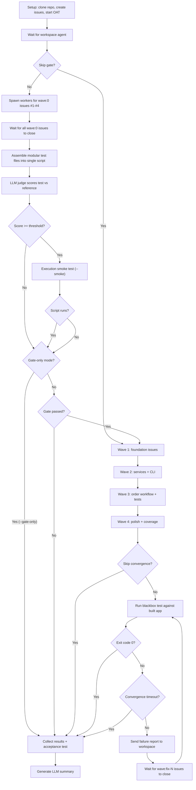

# OAT Multi-Model Benchmarking

> **New to OAT?** Follow the [Getting Started guide](../README.md#getting-started) first to install and set up OAT.

An end-to-end evaluation of how well a coding LLM can build a project from a detailed specification when orchestrated by OAT. The test project is the **robotic barista** -- a Python CLI app for recipe management, inventory tracking, and order processing. The project is defined by a detailed operational spec, interface contracts, and 24 pre-defined issues organized into dependency waves, but contains no implementation code.

The benchmark evaluates a model's ability to:

- Read and follow a detailed spec, interface contracts, and issue descriptions
- Design a blackbox acceptance test that validates the spec was implemented correctly
- Build the full application across 4 dependency waves (24 issues)
- Self-correct via a convergence loop when the blackbox test fails
- Coordinate multiple workers, resolve merge conflicts, and pass CI

## Table of Contents

- [Quickstart](#quickstart)
- [Prerequisites](#prerequisites)
- [How It Works](#how-it-works)
  - [Benchmark Flow](#benchmark-flow)
  - [Test Integrity](#test-integrity)
  - [Gate Scoring Rubric](#gate-scoring-rubric)
- [Understanding Waves](#understanding-waves)
- [Full Benchmark Workflow](#full-benchmark-workflow)
  - [Automated](#automated-recommended)
  - [Comparing Runs](#comparing-runs)
  - [Monitoring](#monitoring-a-running-benchmark)
  - [Manual Workflow](#manual-workflow)
- [Model Strings](#model-strings)
- [Scripts Reference](#scripts-reference)
  - [run.sh](#runsh----fully-automated-benchmark-recommended)
  - [setup.sh](#setupsh----create-benchmark-repo-and-start-oat)
  - [collect.sh](#collectsh----gather-results-after-oat-completes)
  - [acceptance-test.sh](#acceptance-testsh----functional-smoke-test)
  - [summarize.sh](#summarizesh----llm-powered-benchmark-analysis)
- [Cleaning Up a Benchmark Run](#cleaning-up-a-benchmark-run)
- [Using Ollama Models](#using-ollama-models)
- [Troubleshooting](#troubleshooting)
- [Files](#files)

## Quickstart

```bash
# 1. Run a benchmark (creates repo, starts OAT, runs all 4 waves, collects results)
GH_TOKEN=$GH_TOKEN ./benchmarks/run.sh --model claude-sonnet-4-6 --name sonnet46

# 2. Monitor progress in another terminal
oat ui --repo oat-robotic-barista-sonnet46

# 3. Results are saved automatically in a timestamped folder:
#    benchmarks/results/YYYYMMDD-HHMMSS-sonnet46/
#      terminal-output.txt       Full run log (stdout/stderr)
#      gate.json                 Blackbox gate judgment
#      gate-generated-test.sh    Model's generated test script
#      collect.json              Operational metrics
#      acceptance.json           Reference test results
#      convergence.json          Convergence loop results (iterations, verdict)
#      blackbox-acceptance.json  Model-generated test results (final convergence run)
#      summary.md                LLM-generated analysis (requires ANTHROPIC_API_KEY)
#      log-signals.txt           Condensed agent log signals

# 4. To include an LLM summary, pass ANTHROPIC_API_KEY:
GH_TOKEN=$GH_TOKEN ANTHROPIC_API_KEY=$ANTHROPIC_API_KEY \
    ./benchmarks/run.sh --model claude-sonnet-4-6 --name sonnet46

# 5. Clean up when finished
./benchmarks/cleanup.sh --repo oat-robotic-barista-sonnet46 --delete-remote
```

## Prerequisites

- `gh` (GitHub CLI) authenticated
- `jq` for JSON processing
- `oat` installed and daemon running (`oat start`)
- `uv` (Python package manager) for acceptance tests and installing optional provider packages
- `GH_TOKEN` environment variable set (token with `repo` scope -- needed to create benchmark repos and manage issues/PRs)
- `ANTHROPIC_API_KEY` environment variable (optional -- needed for LLM-generated summaries via `summarize.sh`)

**Optional environment variables for tuning benchmark runs:**

| Variable | Default | Description |
|----------|---------|-------------|
| `OAT_FAST_MERGE` | `true` | Daemon auto-merges green PRs. Set to `false` to require merge-queue LLM review |
| `OAT_WORKER_DORMANCY_CAP_MINUTES` | `15` | Max minutes a worker stays dormant before force-merge/cleanup |
| `OAT_CORE_AGENT_SOFT_TIMEOUT` | `5` | Minutes before nudging stuck merge-queue/supervisor |
| `OAT_CORE_AGENT_HARD_TIMEOUT` | `15` | Minutes before restarting stuck merge-queue/supervisor |

**Workspace stuck detection:** `setup.sh` automatically enables workspace stuck detection for benchmark repos (`oat config --workspace-stuck-detection=true`). This is off by default in normal OAT usage because the workspace is user-driven — going quiet just means the human stepped away. Benchmarks enable it because they are unattended: no human is at the keyboard to notice a stuck workspace, and a stuck agent wastes the fixed time budget.

## How It Works

The robotic-barista project is bundled in `benchmarks/robotic-barista/` and includes the operational spec, interface contracts, and all 24 issues. Each benchmark run:

1. Creates a fresh private repo from the bundled scaffold (specs only, no implementation, plus bundled test infrastructure)
2. Populates it with all 24 issues (with labels and dependency metadata)
3. Starts OAT with a specified LLM model
4. **Blackbox Gate:** Workers are created for all wave:0 issues (#1-#4) in parallel -- each writes a modular blackbox test module (`scripts/blackbox-tests/test-*.sh`) using the bundled test framework (`scripts/blackbox-tests/helpers.sh`). The modules are assembled into a single file and scored by an LLM judge against the reference test. If the score is below threshold (default: 70/100), the run stops early -- the model can't understand the spec well enough to converge
5. If the gate passes, OAT's workspace agent drives wave progression (waves 1-4)
6. **Convergence Loop:** After all waves complete, the model-generated blackbox test is run against the built application. If it fails (binary pass/fail), the failure report is sent to the workspace agent which creates fix issues (labeled `wave:fix-N`) and spawns workers. The test is re-run after fixes, repeating up to 4 iterations or until a convergence timeout (default: 60 min)
7. After convergence (or timeout), the reference acceptance test is run against the finished product and results are collected

### Benchmark Flow



### Test Integrity

Because the model both generates the blackbox test and builds the application, the benchmark is designed to prevent the model from gaming its own test to make a broken app pass:

- The test is run by deterministic benchmark software (`run.sh` / `run-blackbox.sh`), not by agents
- Agents never see test output -- only the benchmark script sees results
- Fix-wave workers can only modify test modules via PRs that pass CI
- The human-written `acceptance-test.sh` (the ground truth) is never accessible to agents
- The original gate snapshot is preserved as `gate-generated-test-original.sh` for audit comparison
- The test infrastructure (`helpers.sh`, `blackbox-test.sh` entry point) is bundled in the scaffold -- identical across all runs, so scoring differences reflect test case quality only

### Gate Scoring Rubric

The LLM judge (`judge-blackbox.sh`) compares the model-generated test against the human-written reference `acceptance-test.sh` using a structured rubric. The judge scores across four dimensions, each worth 0-25 points (total 0-100):

| Dimension | Points | What It Measures |
|-----------|--------|------------------|
| **Feature Coverage** | 0-25 | Does the test cover all CLI command groups (inventory, recipes, order, orders)? Are all major operations tested? |
| **Error Handling** | 0-25 | Does the test verify error cases from the spec (unit mismatch, duplicate recipe, invalid state transitions, nonexistent IDs, etc.)? |
| **Workflow Coverage** | 0-25 | Does the test include end-to-end workflows (setup -> place -> validate -> brew -> verify)? Does it test size scaling and inventory consumption? |
| **Test Rigor** | 0-25 | Quality of assertions, scoring system sophistication (weighted categories vs flat pass/fail), CI integration (flags like `--repo`/`--dir`), data persistence checks, robustness of pattern matching |

The default pass threshold is 70/100 (configurable via `--gate-threshold`). Results are saved to `gate.json` with the total score, per-dimension breakdown, and a textual analysis from the judge.

The judge model defaults to `claude-sonnet-4-6` and can be overridden with `--judge-model`.

## Understanding Waves

Issues are labeled with waves that represent dependency ordering:

| Wave | Issues | Description |
|------|--------|-------------|
| 0 | #1-4 | Blackbox gate: modular acceptance test modules (inventory, recipes, orders, workflows) |
| 1 | #5-9 | Foundation: interface contracts, domain entities, repository interfaces, JSON storage |
| 2 | #10-15 | Services + CLI: recipe/inventory/order services and their CLI commands |
| 3 | #16-21 | Order workflow: validation, brewing, CLI commands, integration/system tests |
| 4 | #22-24 | Polish: comprehensive test coverage, documentation, performance |
| fix-0..fix-3 | dynamic | Convergence: fix issues created by workspace agent when blackbox test fails |

Workers on wave N issues depend on wave N-1 being implemented first. For example, a wave 2 worker implementing the Recipe Service needs to see how a wave 1 worker implemented the domain entities.

## Full Benchmark Workflow

### Automated (recommended)

A single command runs the full benchmark end-to-end: setup, wave progression, results collection, and acceptance testing.

```bash
# Run benchmark with Claude Sonnet 4.6
./benchmarks/run.sh --model claude-sonnet-4-6 --name sonnet46-baseline

# Run benchmark with Gemini
./benchmarks/run.sh --model gemini-3.1-pro-preview --name gemini31
```

The script handles everything: creating the repo, populating issues, starting OAT, sending wave instructions to the workspace agent, polling for completion, and running `collect.sh`, `acceptance-test.sh`, and `summarize.sh` when done. Results are saved in a timestamped folder under `benchmarks/results/`.

### Comparing runs

Each run produces a timestamped folder with standardized file names, making comparison easy:

```bash
# Compare acceptance scores across runs
for d in benchmarks/results/*/; do
    if [[ -f "$d/acceptance.json" ]]; then
        score=$(jq -r '.score // "n/a"' "$d/acceptance.json")
        repo=$(jq -r '.repo // "?"' "$d/acceptance.json")
        printf "%-45s Score: %s/100\n" "$(basename "$d")" "$score"
    fi
done

# Read the LLM summaries side by side
cat benchmarks/results/20260304-sonnet46/summary.md
cat benchmarks/results/20260305-opus46/summary.md
```

### Monitoring a running benchmark

While `run.sh` (or a manual run) is in progress, open a separate terminal:

```bash
# Interactive TUI -- send messages, switch between agents, scroll output
oat ui --repo oat-robotic-barista-<name>
```

The TUI supports Tab to switch agents, Ctrl+F to filter output, Ctrl+X to cancel a stuck "Thinking..." state, and PgUp/PgDown to scroll.

Other useful commands:

```bash
oat attach default --repo oat-robotic-barista-<name>   # read-only log tail for a single agent
oat status                                    # one-line daemon/repo overview
oat history --repo oat-robotic-barista-<name>           # task history for a repo
```

### Manual workflow

For more control, you can run each step separately:

#### 1. Set up the benchmark repo

```bash
./benchmarks/setup.sh --model claude-sonnet-4-6 --name sonnet46-baseline --setup-only
```

Check the created repo at `https://github.com/Root-IO-Labs/oat-robotic-barista-sonnet46-baseline`.

#### 2. Initialize OAT

If your default `GH_TOKEN` doesn't have access to the benchmark repo owner, set it explicitly:

```bash
GH_TOKEN=$GH_TOKEN oat init https://github.com/Root-IO-Labs/oat-robotic-barista-sonnet46-baseline --model claude-sonnet-4-6
```

Alternatively, skip `--setup-only` in step 1 to have `setup.sh` run `oat init` for you automatically.

#### 3. Send work to the workspace agent

The simplest way is to send a message directly:

```bash
oat agent tell default "Look at the open issues in this repo. They are organized by wave labels (wave:1, wave:2, wave:3, wave:4) which represent dependency ordering -- wave N issues depend on wave N-1 being completed first. Start by creating workers for the wave:1 issues." --repo oat-robotic-barista-sonnet46-baseline
```

Alternatively, use the interactive TUI:

```bash
oat ui --repo oat-robotic-barista-sonnet46-baseline
```

As each wave completes, instruct the workspace to move on to the next wave.

#### 4. Monitor, collect, and test

```bash
oat ui --repo oat-robotic-barista-sonnet46-baseline

# When done:
./benchmarks/collect.sh --repo oat-robotic-barista-sonnet46-baseline
./benchmarks/acceptance-test.sh --repo oat-robotic-barista-sonnet46-baseline
```

## Model Strings

The `--model` flag uses the format `provider:model-id`. The model ID must match exactly what the provider's API accepts. Invalid model strings produce 404 errors visible only in workspace agent logs (`oat attach default` or `oat ui`).

**Direct providers:**

| Provider | Model String | Env Var Required |
|----------|-------------|-----------------|
| Anthropic | `anthropic:claude-opus-4-6` | `ANTHROPIC_API_KEY` |
| Anthropic | `anthropic:claude-sonnet-4-6` | `ANTHROPIC_API_KEY` |
| Anthropic | `anthropic:claude-haiku-4-5` | `ANTHROPIC_API_KEY` |
| OpenAI | `openai:gpt-5.4` | `OPENAI_API_KEY` |
| OpenAI | `openai:gpt-5.3-codex` | `OPENAI_API_KEY` |
| OpenAI | `openai:gpt-5.2` | `OPENAI_API_KEY` |
| Google | `google_genai:gemini-3.1-pro-preview` | `GOOGLE_API_KEY` |
| Google | `google_genai:gemini-3.1-flash-lite-preview` | `GOOGLE_API_KEY` |
| DeepSeek | `deepseek:deepseek-v3.2` | `DEEPSEEK_API_KEY` |

**Via OpenRouter** (requires `OPENROUTER_API_KEY`, format `openrouter:provider/model-name`):

| Model String |
|-------------|
| `openrouter:deepseek/deepseek-v3.2` |
| `openrouter:deepseek/deepseek-v3.2:nitro` |
| `openrouter:google/gemini-3.1-pro-preview` |
| `openrouter:meta-llama/llama-4-scout` |
| `openrouter:meta-llama/llama-4-maverick` |
| `openrouter:qwen/qwen3.5-397b-a17b` |
| `openrouter:qwen/qwen3-coder-next` |
| `openrouter:moonshotai/kimi-k2.5` |
| `openrouter:moonshotai/kimi-k2-thinking` |

> **`:nitro` variant:** Appending `:nitro` to an OpenRouter model string routes requests through throughput-optimized providers. This improves reliability and speed but may use quantized weights. See [OpenRouter Nitro docs](https://openrouter.ai/docs/guides/routing/model-variants/nitro).

## Scripts Reference

### `run.sh` -- Fully automated benchmark (recommended)

Automates the entire benchmark lifecycle: setup, wave progression, results collection. Sends one natural-language message per wave to the workspace agent via `oat agent tell` (works with all backends), then silently polls GitHub for completion using zero-cost `gh` CLI calls (no tokens burned during polling).

```bash
# Run a full benchmark with Claude Sonnet 4.6
./benchmarks/run.sh --model claude-sonnet-4-6 --name sonnet46

# Test with a different model
./benchmarks/run.sh --model gemini-3.1-pro-preview --name gemini31

# Use one model for supervisor, another for workers
./benchmarks/run.sh --model claude-sonnet-4-6 --worker-model gemini-3.1-pro-preview --name gemini-workers

# Routing mode: strong orchestrator, cheap workers
# --model sets the orchestrator (workspace/supervisor/merge-queue)
# --available-worker-models lists models the workspace can assign to workers
./benchmarks/run.sh --model anthropic:claude-sonnet-4-6 --routing-mode \
  --available-worker-models "ollama:gemma4,google_genai:gemini-3.1-flash-lite-preview" \
  --name routed-test

# Resume a previously set up benchmark
./benchmarks/run.sh --skip-setup --repo oat-robotic-barista-sonnet46

# Longer wave timeout for complex models
./benchmarks/run.sh --model claude-sonnet-4-6 --wave-timeout 60 --timeout 300
```

**Flags:**

| Flag | Required | Description |
|------|----------|-------------|
| `--model <model>` | Yes* | LLM model for orchestrator agents (workspace, supervisor, merge-queue). In routing mode, workers use models from `--available-worker-models` instead. (*unless `--skip-setup`) |
| `--name <suffix>` | No | Repo name suffix (default: Unix timestamp) |
| `--worker-model <model>` | No | Override model for workers (default: same as `--model`) |
| `--wave-timeout <min>` | No | Max minutes per wave (default: 30) |
| `--timeout <min>` | No | Max total minutes (default: 240) |
| `--poll-interval <sec>` | No | Seconds between completion polls (default: 120) |
| `--nudge-timeout <min>` | No | Minutes before sending a nudge within a wave (default: 12) |
| `--skip-setup` | No | Skip setup, use existing repo (requires `--repo`) |
| `--repo <name>` | No | Existing repo name (with `--skip-setup`) |
| `--skip-collect` | No | Skip collect.sh at the end |
| `--skip-acceptance` | No | Skip acceptance-test.sh at the end |
| `--skip-summary` | No | Skip summarize.sh at the end |
| `--skip-gate` | No | Skip the blackbox test gate |
| `--gate-threshold <score>` | No | Pass/fail threshold for gate (default: 70) |
| `--gate-only` | No | Run only the gate, skip waves even if gate passes |
| `--gate-timeout <min>` | No | Max minutes for gate worker (default: 30) |
| `--judge-model <model>` | No | Model for the LLM gate judge (default: `claude-sonnet-4-6`) |
| `--skip-convergence` | No | Skip the post-wave convergence loop |
| `--convergence-timeout <min>` | No | Max total minutes for convergence loop (default: 60) |
| `--convergence-iter-timeout <min>` | No | Max minutes per convergence iteration (default: 30) |
| `--routing-mode` | No | Enable model routing: workspace distributes worker tasks across `--available-worker-models` by complexity |
| `--available-worker-models <m1,m2>` | No | Comma-separated list of models the workspace can assign to workers (requires `--routing-mode`). Does not affect orchestrator agents. Alias: `--available-models` |

**How the benchmark flow works:**
1. **Blackbox gate** (unless `--skip-gate`): spawns parallel workers for all wave:0 issues (#1-#4), each writing a modular test module to `scripts/blackbox-tests/`. After all close, the modules are assembled into a single script and scored by an LLM judge against the reference `acceptance-test.sh`. If below threshold, the run stops early. If the gate passes, an execution smoke test runs the assembled script via `run-blackbox.sh --smoke` to catch runtime errors (unbound variables, syntax issues, bash version incompatibilities) before investing time in waves
2. Sends one message to the workspace agent explaining the wave system and asking it to create workers for wave 1
3. The wave message includes instructions for the workspace to verify workers are on track via output logs
4. Silently polls `gh issue list` every 2 minutes (no agent messages, zero token cost)
5. When all wave N issues are closed, sends a brief message to start wave N+1
6. At the nudge timeout (default: 12 min), sends a single nudge if the wave isn't done yet
7. At full wave timeout (default: 30 min), logs the incomplete state and moves on
8. **Convergence loop** (unless `--skip-convergence`): runs the model-generated blackbox test against the built app. If it fails, sends failure details to the workspace agent, which creates `wave:fix-N` issues and workers. Waits for fixes, then re-runs the test. Repeats up to 4 iterations or until `--convergence-timeout`
9. After convergence, runs `collect.sh`, `acceptance-test.sh`, and `summarize.sh`

**Token budget:** Maximum 8 wave messages (4 instructions + up to 4 nudges), plus up to 4 convergence messages. All polling is external.

### `setup.sh` -- Create benchmark repo and start OAT

```bash
# Basic: create repo + start OAT with Claude Sonnet 4.6 (baseline)
./benchmarks/setup.sh --model claude-sonnet-4-6 --name sonnet46-baseline

# Test with a different model
./benchmarks/setup.sh --model gemini-3.1-pro-preview --name gemini-test

# Override just the worker model (supervisor uses --model, workers use --worker-model)
./benchmarks/setup.sh --model claude-sonnet-4-6 --worker-model gemini-3.1-pro-preview --name gemini-workers

# Setup only (create repo + issues, don't start OAT yet)
./benchmarks/setup.sh --model claude-sonnet-4-6 --setup-only --name dry-run
```

**Flags:**

| Flag | Required | Description |
|------|----------|-------------|
| `--model <model>` | Yes | Default LLM model for all OAT agents |
| `--worker-model <model>` | No | Override model for workers specifically |
| `--name <suffix>` | No | Repo name suffix (default: Unix timestamp) |
| `--setup-only` | No | Only create repo + issues, skip OAT init |

Repos are created as `Root-IO-Labs/oat-robotic-barista-<suffix>`.

The bundled source in `benchmarks/robotic-barista/` already includes all spec clarifications (required flags, data file path, `BARISTA_DATA_DIR` env var, recipe output format, entry point packaging, development environment setup, etc.). No patching is needed at setup time.

### `collect.sh` -- Gather results after OAT completes

Run this manually after OAT finishes working (check with `oat ui` or `oat status`).

```bash
# Collect results
./benchmarks/collect.sh --repo oat-robotic-barista-sonnet46-baseline

# Save to a specific file
./benchmarks/collect.sh --repo oat-robotic-barista-sonnet46-baseline --output results/baseline.json
```

**Flags:**

| Flag | Required | Description |
|------|----------|-------------|
| `--repo <name>` | Yes | Benchmark repo name |
| `--output <path>` | No | Output path (default: `benchmarks/results/<repo>.json`) |

**Output:** JSON report with:
- Issue closure counts (total vs. closed)
- PR counts (created, merged, CI pass/fail)
- Per-wave breakdown (issues closed, PRs merged per wave)
- Per-wave timing (earliest PR created to latest PR merged, using GitHub timestamps)
- Total agent-active time (sum of per-wave durations, excludes human gaps between waves)
- Worker autonomy metrics (self-completed vs. daemon-intervened, self-completion rate)
- Per-PR detail (title, branch, CI status, merge status)

### `acceptance-test.sh` -- Functional smoke test

Tests whether the completed app actually works as specified. Clones the benchmark repo, installs the barista app, and runs through the key user workflows from the operational spec.

```bash
# Test a completed benchmark repo
./benchmarks/acceptance-test.sh --repo oat-robotic-barista-sonnet46-baseline

# Test a local clone
./benchmarks/acceptance-test.sh --dir /path/to/local/clone

# Keep the temp directory for manual inspection
./benchmarks/acceptance-test.sh --repo oat-robotic-barista-sonnet46-baseline --keep
```

**Flags:**

| Flag | Required | Description |
|------|----------|-------------|
| `--repo <name>` | Yes* | Benchmark repo name (*or use `--dir`) |
| `--dir <path>` | No | Use a local directory instead of cloning |
| `--keep` | No | Preserve temp directory after testing |
| `--output <path>` | No | Output path (default: `benchmarks/results/<repo>-acceptance.json`) |

**What it tests:**
- Inventory commands (add, list, unit mismatch error)
- Recipe commands (add, list, show, not-found error)
- Full order workflow (place -> validate -> brew -> list)
- Size scaling (S, M, L orders)
- Error handling (invalid state transitions, nonexistent recipes)
- Data persistence (barista.json exists and is valid)

### `summarize.sh` -- LLM-powered benchmark analysis

Extracts key signals from agent/worker logs and sends them (along with the JSON results) to the Claude API for a human-readable summary. Automatically called by `run.sh` at the end of each benchmark run.

```bash
# Summarize results in a timestamped folder
ANTHROPIC_API_KEY=$ANTHROPIC_API_KEY ./benchmarks/summarize.sh \
    --dir benchmarks/results/20260304-011245-sonnet46

# Extract log signals only (no API key needed)
./benchmarks/summarize.sh --dir benchmarks/results/20260304-011245-sonnet46 --signals-only

# Specify repo name manually (if auto-detect fails)
ANTHROPIC_API_KEY=$ANTHROPIC_API_KEY ./benchmarks/summarize.sh \
    --dir benchmarks/results/my-run --repo oat-robotic-barista-sonnet46
```

**Flags:**

| Flag | Required | Description |
|------|----------|-------------|
| `--dir <path>` | Yes | Path to timestamped results directory |
| `--repo <name>` | No | OAT repo name for log lookup (auto-detected from collect.json) |
| `--model <model>` | No | Claude model for summary (default: claude-sonnet-4-6; override if API model list changes) |
| `--output <path>` | No | Output file (default: `<dir>/summary.md`) |
| `--signals-only` | No | Only extract log signals, skip Claude API call |

**What it analyzes:**
- Operational metrics (collect.json) and functional test results (acceptance.json)
- Blackbox gate results (gate.json) -- score breakdown, verdict, model understanding of spec
- Dual-run comparison (acceptance.json vs blackbox-acceptance.json) -- reference vs model-generated test scores
- Worker log signals: errors, merge conflicts, CI failures, daemon interventions, stuck patterns
- System agent logs: supervisor/merge-queue/workspace decisions and anomalies
- Daemon log: nudges, force removals, idle mode transitions, PR monitor events

**Output:** A structured markdown report covering executive summary, scorecard, what went well/wrong, token efficiency concerns, per-wave breakdown, acceptance test analysis, blackbox gate analysis, dual-run comparison, and recommendations.

**Cost:** Approximately $0.10-0.15 per summary using Claude Sonnet (25K input tokens, 4K output tokens). The default model is `claude-sonnet-4-6`; pass `--model` to use a different Anthropic model ID.

### Summarizing existing runs

To summarize results from a previous run that wasn't saved in a timestamped folder, create one and move the files:

```bash
mkdir -p benchmarks/results/20260303-1700-sonnet46
mv benchmarks/results/oat-robotic-barista-sonnet46.json benchmarks/results/20260303-1700-sonnet46/collect.json
mv benchmarks/results/oat-robotic-barista-sonnet46-acceptance.json benchmarks/results/20260303-1700-sonnet46/acceptance.json

ANTHROPIC_API_KEY=$ANTHROPIC_API_KEY ./benchmarks/summarize.sh \
    --dir benchmarks/results/20260303-1700-sonnet46 --repo oat-robotic-barista-sonnet46
```

## Cleaning Up a Benchmark Run

Use `cleanup.sh` to remove all local state from a failed or completed benchmark run. This includes OAT state, agent sessions, worktrees, the cloned repo, and output logs (`~/.oat/output/<repo>/`):

```bash
# Clean up local state
./benchmarks/cleanup.sh --repo oat-robotic-barista-sonnet46-auto

# Also delete the GitHub repo (requires delete_repo scope on token)
./benchmarks/cleanup.sh --repo oat-robotic-barista-sonnet46-auto --delete-remote
```

If `--delete-remote` fails due to token permissions, delete the GitHub repo manually at `https://github.com/Root-IO-Labs/oat-robotic-barista-<name>/settings` (Danger Zone > Delete).

Alternatively, skip cleanup entirely by using a different `--name` for each run.

## Git Hygiene Notes

OAT automatically writes a `.oat/.gitignore` inside each worker's worktree to prevent runtime files (`AGENTS.md`, `settings.json`) from being committed. No manual `.gitignore` configuration is needed for `.oat/` files.

For the robotic-barista benchmark, `.testmondata*` files (pytest-testmon SQLite caches copied into worktrees for faster test runs) are already listed in the project's `.gitignore`. If you create a new benchmark template, add `.testmondata`, `.testmondata-shm`, and `.testmondata-wal` to its `.gitignore`.

## Using Ollama Models

If you want to use local Ollama models (e.g., `ollama:gemma4`) as worker models in routing mode:

1. **Install Ollama:** Download from [ollama.com](https://ollama.com) and ensure it's running
2. **Pull the model:** `ollama pull gemma4` (or whichever model you want)
3. **Install the Python provider package** into OAT's agent runtime venv:

```bash
cd agent-runtime/libs/cli && uv pip install langchain-ollama
```

`oat-agent` uses a `uv`-managed venv inside `agent-runtime/libs/cli/.venv/` -- installing `langchain-ollama` via system `pip` won't work. The venv doesn't include `pip`, so you must use `uv` to install into it.

4. **Onboard the model:** `oat model onboard ollama:gemma4 --save`

**Multiple Ollama models:** If using more than one Ollama model simultaneously, set `OLLAMA_MAX_LOADED_MODELS` to the number of models before starting Ollama.

**Orchestrator vs worker:** Ollama models are best suited as **worker** models via `--available-worker-models`. The orchestrator (`--model`) should be a capable hosted model (e.g., `anthropic:claude-sonnet-4-6`) since it handles complex multi-step coordination that small local models struggle with.

## Troubleshooting

### ANSI escape codes appearing in the agent input box

If you see raw terminal formatting (colored text, status-bar fragments like `[oat-oat-be: supervisor- 1: merge-queue 2: default…]`) in the agent's input area, this is ANSI escape sequence leakage from tool output.

**Cause:** When the workspace agent runs tools that capture terminal content (e.g. reading agent output logs), the raw output may include ANSI escape sequences for colors and cursor positioning. If the agent runtime renders that tool output without stripping ANSI codes, the sequences appear as visible garbage in the input box.

**Where the fix belongs:** The agent runtime (oat-agent) should strip ANSI escape sequences from terminal/tool output before rendering it or adding it to the model context. OAT itself does not inject terminal output into messages, so no OAT code change is required unless a future feature adds terminal output to messages (in which case, strip ANSI there too).

## Files

| File | Purpose |
|------|---------|
| `run.sh` | Fully automated benchmark runner (gate + setup + wave progression + collection) |
| `setup.sh` | Create benchmark repo, populate issues, start OAT |
| `judge-blackbox.sh` | LLM judge comparing model-generated test vs reference |
| `run-blackbox.sh` | Shim wrapper: run model-generated test, produce JSON results (`--smoke` for stub CLI at gate time) |
| `collect.sh` | Collect results from a completed benchmark run |
| `acceptance-test.sh` | Functional smoke test of the barista CLI (reference test) |
| `summarize.sh` | Extract log signals and generate LLM-powered summary |
| `cleanup.sh` | Clean up local and remote state from a benchmark run |
| `blackbox-testing.md` | General CLI blackbox testing methodology guide (copied into target repo during setup) |
| `issues.json` | Pre-captured issue data (24 issues with titles, bodies, labels) |
| `results/` | Output directory for timestamped result folders (gitignored) |
