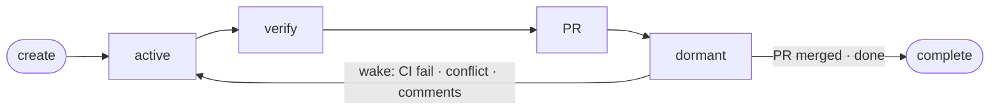

# OAT Quick Start

This guide is designed to be read by both humans and AI agents. It covers everything needed to install, configure, and operate OAT from scratch.

## Prerequisites

| Dependency | Minimum Version | Install |
|---|---|---|
| **Go** | 1.24.2+ | https://go.dev/dl/ |
| **Python** | 3.11+ | https://www.python.org/downloads/ |
| **uv** | latest | `curl -LsSf https://astral.sh/uv/install.sh \| sh` |
| **git** | any recent | https://git-scm.com/ |
| **gh** (GitHub CLI) | any recent | `brew install gh` / https://cli.github.com |
| **API key** | *(optional)* | Only needed for cloud LLM providers (not for local models like Ollama) |

Verify prerequisites:

```bash
go version        # must be 1.24.2+
python3 --version # must be 3.11+
uv --version
git --version
gh auth status    # must show "Logged in to github.com"
```

If `gh` is not authenticated: `gh auth login`

## Install

```bash
git clone https://github.com/Root-IO-Labs/open-agent-teams.git
cd open-agent-teams
./scripts/install.sh
```

The install script:
- Checks all prerequisites (Go, Python, uv)
- Builds and installs `oat` and `oat-agent` to `$GOPATH/bin`
- Symlinks `agent-runtime/` next to the binaries
- Creates the Python virtual environment via `uv sync`

Re-running after `git pull` safely updates everything.

### Verify installation

```bash
which oat oat-agent
oat version
```

### Ensure `$GOPATH/bin` is in your PATH

```bash
echo $PATH | tr ':' '\n' | grep "$(go env GOPATH)/bin"

# If missing, add permanently:
echo 'export PATH="$PATH:$(go env GOPATH 2>/dev/null)/bin"' >> ~/.zshrc
source ~/.zshrc
```

## Set Up LLM Credentials

OAT needs an API key for whichever LLM provider you want to use. If you're running a local model (e.g. Ollama), skip this step.

**Recommended: OAT's built-in `.env` file** (persists across sessions):

```bash
mkdir -p ~/.oat
echo 'ANTHROPIC_API_KEY=sk-ant-...' >> ~/.oat/.env
```

**Alternative: shell profile export** (OAT auto-sources `~/.zshrc` and `~/.bashrc`):

```bash
echo 'export ANTHROPIC_API_KEY=sk-ant-...' >> ~/.zshrc
```

**Per-repo override:** To use a different provider or key for a specific project:

```bash
mkdir -p ~/.oat/repos/<repo-name>
echo 'OPENAI_API_KEY=sk-...' >> ~/.oat/repos/<repo-name>/.env
```

Per-repo keys take priority over the global `~/.oat/.env`.

### Common model strings

| Provider | Model String | Env Var |
|----------|-------------|---------|
| Anthropic | `anthropic:claude-sonnet-4-6` | `ANTHROPIC_API_KEY` |
| Anthropic | `anthropic:claude-opus-4-6` | `ANTHROPIC_API_KEY` |
| OpenAI | `openai:gpt-5.2` | `OPENAI_API_KEY` |
| Google | `google_genai:gemini-3.1-pro-preview` | `GOOGLE_API_KEY` |
| DeepSeek | `deepseek:deepseek-v3.2` | `DEEPSEEK_API_KEY` |
| OpenRouter | `openrouter:deepseek/deepseek-v3.2` | `OPENROUTER_API_KEY` |
| Ollama | `ollama:llama3:70b` | *(none — local)* |

Model format: bare name (`claude-sonnet-4-6`) or provider-prefixed (`anthropic:claude-sonnet-4-6`). Auto-detection works for well-known names (`claude-*` → Anthropic, `gpt-*`/`o1`/`o3`/`o4` → OpenAI, `gemini-*` → Google). For other providers, use the `provider:model` format.

See [SUPPORTED_LLM_PROVIDERS.md](SUPPORTED_LLM_PROVIDERS.md) for the full list of 17+ providers, custom provider setup via `config.toml`, and auto-detect behavior.

## Start the Daemon

```bash
oat start
oat status          # verify: should show the daemon running
```

The daemon is a background process that manages all agent sessions, routes messages, monitors PRs, and handles lifecycle. It must be running for any OAT operation.

## Initialize a Repository

```bash
oat init <github-url> [name] [--model <model>]
```

Examples:

```bash
oat init https://github.com/myorg/myproject --model claude-sonnet-4-6
oat init https://github.com/myorg/myproject myproject --model gpt-5.2
```

This clones the repo, creates a supervisor, merge queue (or PR shepherd for forks), and a default workspace. Fork detection is automatic.

Set a default repo to avoid `--repo` on every command:

```bash
oat repo use myproject
oat repo current         # verify
```

## Create Workers

```bash
oat worker create "<task description>"
```

Each worker gets its own git worktree on branch `work/<name>` and works autonomously.

### Worker creation flags

| Flag | Purpose |
|------|---------|
| `--issue <number>` | Tie task to a GitHub issue |
| `--issue-url <url>` | Full issue URL (alternative to `--issue`) |
| `--model <model>` | Override the repo default model for this worker |
| `--branch <ref>` | Start from a specific branch or ref instead of main |
| `--push-to <branch>` | Push to an existing branch (requires `--branch`) |
| `--name <name>` | Fixed worker name instead of auto-generated |
| `--repo <repo>` | Target repo (if not using default) |

### Examples

```bash
oat worker create "Add unit tests for the auth module"
oat worker create "Implement feature per issue #42" --issue 42
oat worker create "Complex refactor" --model claude-opus-4-6
oat worker create "Fix review comments on PR #48" \
  --branch origin/work/calm-deer \
  --push-to work/calm-deer
```

## Two-Terminal Workflow

| Terminal | Purpose | What runs here |
|---|---|---|
| **Terminal 1** — Control | Send commands, create workers, check status | `oat worker create`, `oat status`, `oat agent tell` |
| **Terminal 2** — Watch | Live-tail agent output | `oat ui`, `oat attach`, `tail -f ~/.oat/daemon.log` |

### Terminal 1 — Control

```bash
oat agent tell workspace "What is this repo about?" --repo $REPO
oat worker create "Add a health-check endpoint" --repo $REPO
oat status
oat worker list --repo $REPO
```

### Terminal 2 — Watch

```bash
oat ui                                # full-screen dashboard (recommended)
oat attach workspace --repo $REPO     # stream a single agent
oat attach supervisor --repo $REPO
tail -f ~/.oat/daemon.log
```

## Worker Lifecycle

**If the diagram does not render** (plain-text viewer): happy path is `create → active → verify → PR → dormant → complete`. From **dormant**, either the PR is finished → **complete**, or the daemon wakes the worker → **active** again (CI fail, merge conflict, PR comments), then **verify → PR → dormant** repeats.



While **dormant**, the daemon polls GitHub (~2 min). After a wake, the worker fixes on the same `work/<name>` branch, runs **verify** again, updates the PR as needed, and calls **`oat agent waiting`** to return to **dormant**. **`oat agent complete`** finishes the worker; the daemon cleans up the worktree on the next health check (~2 min).

1. **Active** — Worker codes, commits, pushes on `work/<name>` branch
2. **Verify** — Quality gate before PR: `oat worker verify`, `oat worker request-review`, or `oat pr create --force` to skip
3. **PR** — `oat pr create` opens a pull request with the `oat` label (later rounds update the same branch / PR)
4. **Dormant** — Zero-token sleep; daemon monitors PR for CI, conflicts, comments, merge
5. **Complete** — `oat agent complete`; daemon cleans up worktree on next health check (~2 min)

## Monitoring

```bash
oat status                           # all agents, repos, idle/active status
oat worker list                      # active workers
oat attach <agent> --read-only       # stream an agent's output
oat ui [--repo <repo>]               # full-screen dashboard
oat logs list                        # available log files
oat logs search "error"              # search across logs
oat daemon status                    # daemon health
oat daemon logs [-f]                 # daemon logs (follow mode)
```

## Messaging

```bash
oat message send <target-agent> "your message"
oat message list
oat message read <id>
oat message ack <id>
oat tell <agent> "message"           # direct PTY input (alternative)
```

## Repo Management

```bash
oat repo list                        # tracked repos
oat repo use <name>                  # set default
oat repo current                     # show default
oat repo unset                       # clear default
oat repo rm <name>                   # remove
oat repo history                     # task history
oat repo hibernate [--all] [--yes]   # pause, archive uncommitted work
```

## Configuration

```bash
oat config                           # show current config
oat config --mq-enabled=true|false   # enable/disable merge queue
oat config --mq-track=all|author|assigned
oat config --ps-enabled=true|false   # enable/disable PR shepherd
oat config --ps-track=all|author|assigned
oat config --workspace-stuck-detection=true|false
```

## Reviews

```bash
oat review <pr-url>                  # spawn a review agent for a specific PR
```

## Custom Agents

```bash
oat agents list                      # list available agent definitions
oat agents reset                     # reset to built-in defaults
oat agents spawn \
  --name <name> \
  --class persistent|ephemeral \
  --prompt-file <path.md> \
  [--task "description"]
```

Agent definition precedence:
1. `<repo>/.oat/agents/<agent>.md` (team-shared, highest priority)
2. `~/.oat/repos/<repo>/agents/<agent>.md` (local override)
3. Built-in templates (fallback)

Worker prompt extensions: place files in `oat-worker-prompt-extensions/` at repo root.

## Command Cheat Sheet

```bash
# Daemon
oat start                            # start daemon
oat stop                             # stop daemon
oat restart                          # restart daemon
oat status                           # system overview

# Repos
oat init <github-url> [--model M]    # initialize a repo
oat repo list                        # list repos
oat repo use <name>                  # set default repo

# Workers
oat worker create "<task>" [--issue N] [--model M]
oat worker list
oat worker rm <name>

# Watch
oat ui                               # full-screen dashboard
oat attach <agent> --read-only       # stream agent output

# Communication
oat agent tell <name> "message"
oat agent interrupt <name>
oat agent restart <name>

# Cleanup
oat stop-all --clean                 # stop everything, destroy state
oat cleanup --dry-run                # preview cleanup
oat cleanup                          # clean orphaned worktrees/messages
```

## Agent Types

| Type | Lifecycle | Purpose |
|------|-----------|---------|
| supervisor | Persistent | Coordinates workers, detects stuck agents, reports status |
| merge-queue | Persistent | Merges PRs when CI passes (owned repos) |
| pr-shepherd | Persistent | Manages PRs for forks, coordinates with upstream |
| workspace | Persistent | User interactive session, spawns workers |
| worker | Ephemeral | Executes a task, creates a PR, completes |
| reviewer | Ephemeral | Reviews PRs before merge |
| verification | Ephemeral | Independent quality gate before PR creation |

## Environment Variables

| Variable | Default | Purpose |
|----------|---------|---------|
| `OAT_FAST_MERGE` | `true` | Daemon auto-merges green PRs |
| `OAT_WORKER_DORMANCY_CAP_MINUTES` | `15` | Max dormancy before timeout |
| `OAT_CORE_AGENT_SOFT_TIMEOUT` | `5` | Minutes before nudging stuck core agents |
| `OAT_STUCK_SUPERVISOR_NUDGE` | `10` | Nudge count before alerting supervisor |
| `OAT_STUCK_DAEMON_NUDGE` | `16` | Nudge count before daemon takeover |
| `OAT_STUCK_MAX_NUDGE` | `30` | Nudge count before force-removal |
| `OAT_WAKE_INTERVAL_SECONDS` | `60` | Wake/nudge loop interval |
| `OAT_TEST_MODE` | *(unset)* | Skip real agent spawning (for tests) |

## Directory Structure

```
~/.oat/
  .env                   # global API keys (all repos)
  daemon.pid             # daemon process ID
  daemon.sock            # Unix socket (CLI <-> daemon)
  daemon.log             # daemon logs
  state.json             # all state: repos, agents, config
  config.toml            # custom model providers
  repos/<repo>/          # cloned repositories
    .env                 # per-repo API key overrides
  wts/<repo>/<agent>/    # git worktrees (one per agent)
  messages/<repo>/<agent>/ # inter-agent messages (JSON files)
  output/<repo>/         # agent output logs
  agent-config/<repo>/<agent>/ # per-agent slash commands
  prompts/               # generated prompt files
```

## Maintenance

```bash
oat repair [--verbose]               # fix broken state
oat cleanup [--dry-run] [--verbose]  # clean orphaned worktrees/messages
oat cleanup --merged                 # clean merged work/ and oat/ branches
oat sync                             # sync all worktrees with remote
oat sync --branch dev                # sync worktrees against a specific branch
oat stop-all                         # stop everything, preserve state
oat stop-all --clean [--yes]         # stop everything, destroy state
```

## Diagnostics

```bash
oat version [--json]
oat diagnostics [--json] [--output <file>]
oat bug [--output <file>] [--verbose]
```
