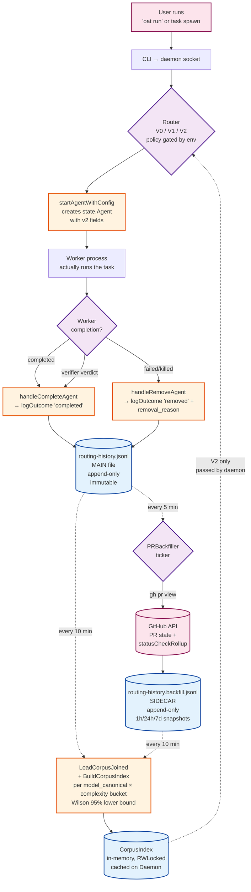
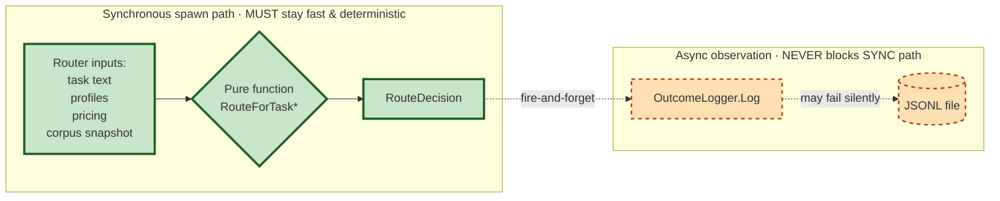
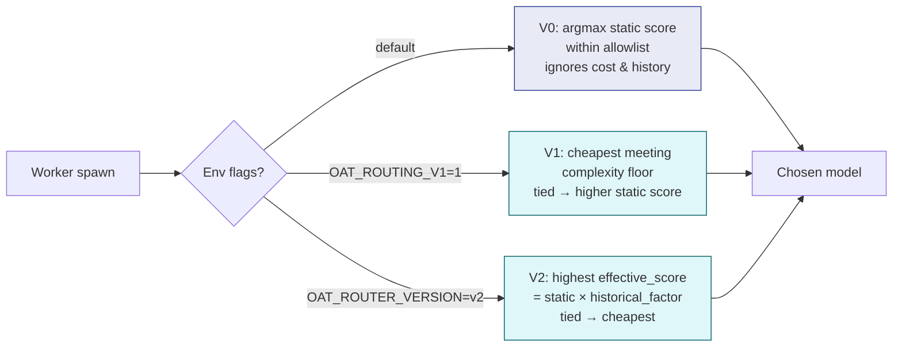
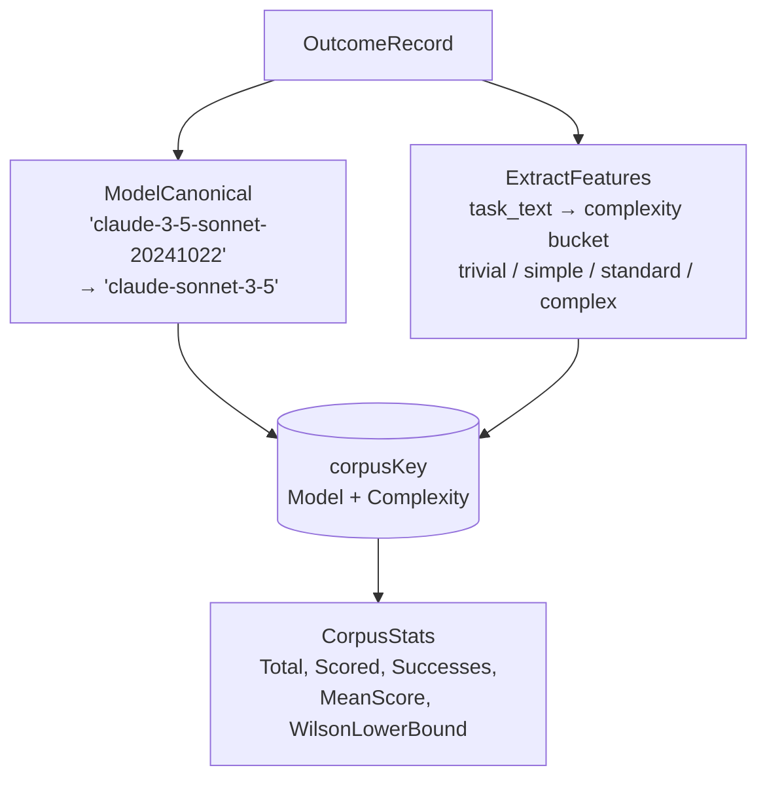
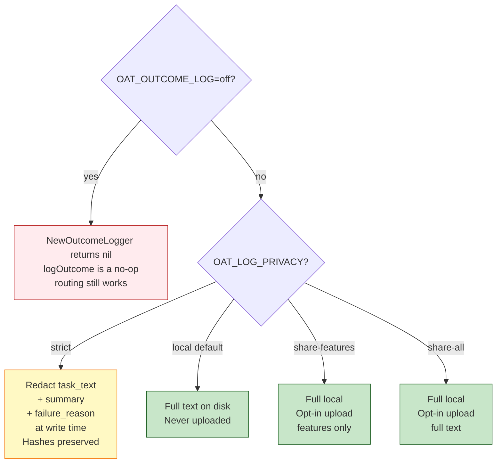

# Routing Schema v2 — Architecture

How the loop works end-to-end. Every diagram below renders in GitHub's
Markdown viewer; no extra tooling needed.

---

## 1. The full data flow



The dashed arrows are async — they don't block the synchronous worker
spawn / completion path. The synchronous path (solid arrows) goes from
user action straight to the worker, never blocked by I/O on the corpus
files.

---

## 2. The cardinal rule (router does not depend on logger)



Enforced by three regression tests:

- `TestRouteForTask_DeterministicGivenInputs` — 200 calls with identical
  inputs must return byte-identical outputs.
- `TestRouteForTask_NoLoggerImport` — `route_for_task.go`'s import set must
  be a subset of `{fmt, sort}`. Adding requires explicit review.
- `TestRouteForTask_NoSymbolReferences` — AST scan: the router file must
  not reference `OutcomeLogger`, `OutcomeRecord`, `PRBackfiller`,
  `LoggedTaskFeatures`, etc. by name.

Plus 5 logger-resilience tests prove broken-disk / nil-receiver / concurrent
writes don't propagate errors back to the router.

---

## 3. The three router policies (gated by env vars)



| | V0 (default) | V1 | V2 |
|---|---|---|---|
| **Activation** | always on | `OAT_ROUTING_V1=1` | `OAT_ROUTER_VERSION=v2` |
| **Optimizes for** | capability (static score) | cost | evidence-weighted capability |
| **Reads corpus?** | no | no | yes (snapshot, every 10 min) |
| **Tiebreaker** | tier index | static score → tier | cost → tier |
| **Risk profile** | predictable | aggressive cost | self-correcting via history |

V2's `historical_factor`:

- `1.0` (no adjustment) when `bucket.Scored < MinHistoricalSamples` (=5)
- `max(0.5, wilson_lower_bound_95)` when ≥5 samples

The 0.5 floor stops a bad streak from fully banishing a model. The
threshold of 5 stops noisy small-N data from dominating the static prior.

---

## 4. The bucket key — why model_canonical × complexity



**Why canonical model**: a deprecated point release of sonnet shouldn't
lose its history when the user upgrades. `claude-3-5-sonnet-20240620` and
`claude-3-5-sonnet-20241022` both bucket as `claude-sonnet-3-5` so signal
survives rotation.

**Why complexity**: a model that fails refactors might still ace typos.
Scoring per-bucket prevents one failure mode from poisoning the model's
overall reputation. The `ExtractFeatures` heuristic classifier (in
`task_classifier.go`) runs at index-build time so the same task always
hashes to the same bucket.

---

## 5. Privacy & kill switch — orthogonal to routing



Critical: privacy operates at write time; redaction is irreversible. A
strict-mode record never had `task_text` and never can. Hashes
(`prompt.user_message_hash`, etc.) are preserved across every mode by
design — they're privacy-safe and downstream analyses still work.

---

## 6. The recovered-worker case (the loop's hardest test)

```mermaid
sequenceDiagram
    participant Worker
    participant Daemon
    participant Main as Main JSONL
    participant Sidecar
    participant Backfill as Backfiller
    participant GH as GitHub
    participant Index as CorpusIndex

    Worker->>Daemon: spawn task X
    Daemon->>Daemon: V2 router picks model M
    Worker->>Worker: runs, creates PR #42, fails internally
    Worker->>Daemon: complete? no — supervisor force-removes
    Daemon->>Main: outcome=removed, removal_reason=failed, pr_number=42

    Note over Main,Sidecar: Several hours pass.<br/>Someone fixes the PR; it merges.

    loop every 5 min
        Backfill->>Main: scan for records with PR
        Backfill->>GH: gh pr view 42 --json state,statusCheckRollup
        GH->>Backfill: state=merged, ci_status=passed
        Backfill->>Sidecar: append snapshot {state:merged, lag_bucket:24h}
    end

    loop every 10 min
        Daemon->>Main: read all
        Daemon->>Sidecar: read all
        Daemon->>Index: BuildCorpusIndex(joined)
        Note right of Index: Bucket(M, complexity_X) now has<br/>1 record with success_score=1.0<br/>(pr_merged outranks the<br/>original outcome=removed)
    end

    Note over Worker,Index: Next time someone routes a similar task...

    Worker->>Daemon: spawn task X' (same complexity)
    Daemon->>Index: Lookup(M, complexity_X)
    Index->>Daemon: scored, factor would apply at N≥5
    Daemon->>Daemon: V2 routes accordingly
```

The key insight: the main file is **immutable**. The original
`outcome=removed/failed` record is never overwritten. The merge observation
lives in the sidecar. `LoadCorpusJoined` folds the sidecar into the
record's `PRStateHistory` at read time. `DeriveSuccessScore` then sees
the merged state and produces 1.0, basis=`pr_merged` — the strongest
positive evidence available.

That's the loop closing.

---

## 7. Failure modes & what happens

| If this breaks... | Effect |
|---|---|
| `~/.oat/routing-history.jsonl` is unwritable (disk full, permission) | Logger warns, continues. Routing decisions unaffected. Records for that period are lost. |
| `gh` CLI fails / no auth | Backfiller warns, retries next tick. PR observations don't accrue, but main file keeps growing. |
| `routing-history.backfill.jsonl` missing or malformed | LoadCorpusJoined returns main records with empty PRStateHistory. Reports show immediate-signal-only scores. |
| CorpusIndex refresh fails | V2 router uses the previous snapshot (or nil → V1-equivalent). |
| Daemon crashes mid-write | Main file uses append + line-buffered writes; at most one record torn. Sidecar same. |
| User on a fresh install, no history | All buckets are empty → V2 falls through to "no corpus" branch (V1-equivalent ranking). |
| `OAT_OUTCOME_LOG=off` | NewOutcomeLogger returns nil. Routing still works exactly the same; nothing's logged. |
| `OAT_LOG_PRIVACY=strict` | task_text/summary/failure_reason redacted on disk. Hashes preserved. Reports work; sharing still requires explicit opt-in. |

The architecture's point: every async/observational component can fail
without breaking the routing-decision hot path.

---

## 8. Try it yourself

```bash
# Preview what the router would pick for a given task (no worker spawn)
oat routing route --task "Fix the typo 'recieve' in cli.py" --all

# Compare V1 vs V2 — they pick differently because they optimize for
# different things (cost vs evidence-weighted capability).

# See aggregate per-model success on your real corpus
oat routing report

# See the privacy mode you're currently in
oat routing privacy

# Walk the entire pipeline against a synthetic corpus (real ~/.oat/ untouched)
./scripts/demo-schema-v2.sh
```
